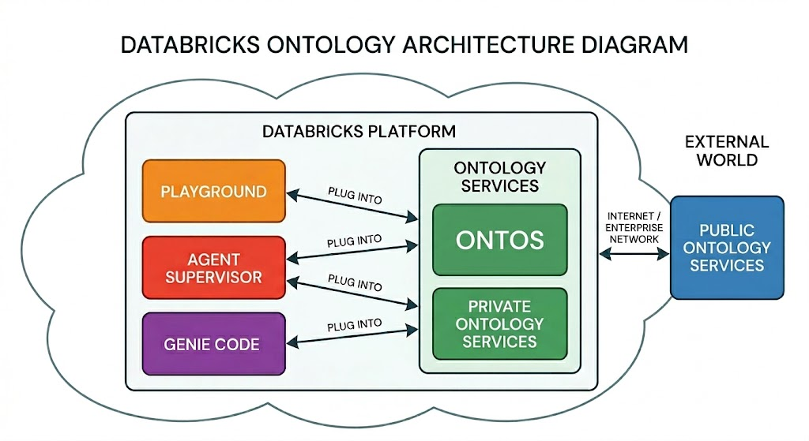

%md
## Synthetic Visit Occurrence — Liver Disease

### Ontology Lookup Service (OLS) via MCP

This notebook leverages the **OLS MCP service** (Ontology Lookup Service, exposed as Model Context Protocol tools) to source clinically accurate ICD-10 codes for liver disease. Starting from **DOID:409** (*liver disease*) in the Disease Ontology, the `getDescendants` and `searchClasses` MCP tools were used to traverse the ontology hierarchy and identify the ICD-10 codes in the **K70–K77** range — covering alcoholic liver disease, cirrhosis, steatotic liver disease, hepatic failure, and liver cancer. This ensures the synthetic data is grounded in a governed, standards-based classification rather than manually curated code lists.

### Certified Table Reference for Schema & Metadata

Genie Code resolved the `@visit_occurrence` table reference by following a **certified-first resolution** strategy:

1. **Search** — `tableSearch` identified candidate tables matching `visit_occurrence` across Unity Catalog.
2. **Certification check** — `readTable` with `extraDetails=true` confirmed that **`main.omop.visit_occurrence`** carries a **certified** governance tag, making it the authoritative source.
3. **Schema extraction** — The 17-column schema (types, nullability, column comments) was read from the certified table and faithfully mapped to a PySpark `StructType`.
4. **Metadata propagation** — After writing the synthetic DataFrame to `dmoore.project-2026-april.visit_occurrence`, all metadata was propagated from the certified source in separate DDL statements: table comment, column comments, table-level tags (`industry = HLS`), and column-level tags (`phi = true`).

This approach guarantees that derived tables inherit the governance posture of their certified source — comments, tags, and policies travel with the data.

### Workflow Diagram

